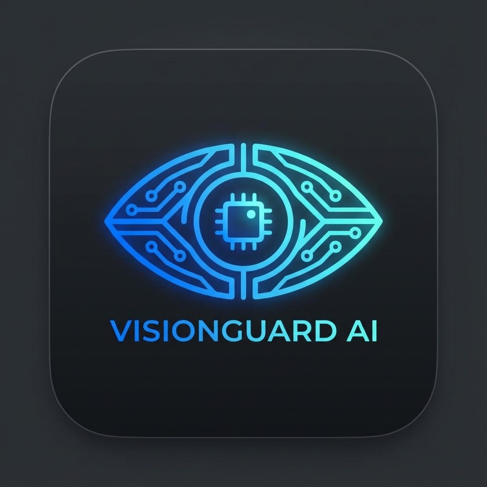

# 🎭 VisionGuard AI

> Advanced AI-powered camera monitoring system with real-time face recognition, phone detection, and behavioral analysis.

[](https://opensource.org/licenses/MIT)
[](https://www.python.org/downloads/)
[](https://www.docker.com/)
[](https://github.com/ultralytics/ultralytics)



## 🌟 Features

### 🤖 AI Detection
- **Face Recognition**: Real-time face detection and recognition using dlib
- **Phone Usage Detection**: Detects phone usage with head-down posture validation
- **Sitting Detection**: Advanced skeleton analysis with chair proximity detection
- **Object Segmentation**: YOLOv8-based instance segmentation
- **Pose Estimation**: 17-keypoint human pose tracking

### 🎨 Modern UI
- **Glassmorphism Design**: iOS 26-inspired minimal dark theme
- **Dark/Light Mode**: Toggle between themes with localStorage persistence
- **Real-time Stats**: FPS counter, alert count, sitting sessions
- **Alert Flash Effect**: Shooter-style visual feedback on phone detection
- **Responsive Dashboard**: Analytics, statistics, and data export

### 📊 Dashboard & Analytics
- **Statistics Cards**: Total alerts, sitting sessions, averages
- **Data Tables**: Phone alerts and sitting history with preview
- **Excel Export**: Download complete data in XLSX format
- **Auto-refresh**: Real-time updates every 5 seconds

### 💾 Data Management
- **SQLite Database**: Persistent storage for all detections
- **Image Captures**: Automatic screenshot on phone detection
- **Export Functionality**: Excel export with styled headers

### ⚡ Performance
- **Optimized Inference**: 25-40 FPS with GPU acceleration
- **Half Precision**: FP16 for faster YOLO inference
- **Smart Processing**: Face recognition every 3 frames
- **Low Latency**: Optimized JPEG encoding

---

## 🚀 Quick Start

### Prerequisites
- Docker & Docker Compose
- NVIDIA GPU (optional, but recommended)
- Webcam

### Installation

1. **Clone the repository**
```bash
git clone https://github.com/endrisusanto/visionguard-ai.git
cd visionguard-ai
```

2. **Add face references** (optional)
```bash
mkdir -p faces
# Add photos: faces/John_Doe.jpg, faces/Alice.png, etc.
```

3. **Start with Docker**
```bash
docker compose up -d
```

4. **Access the application**
- Live Monitor: http://localhost:2123/
- Dashboard: http://localhost:2123/dashboard

---

## 📖 Documentation

### Face Recognition Setup

Add reference photos to the `faces/` folder:
```bash
faces/
├── John_Doe.jpg
├── Alice_Smith.png
└── Bob_Johnson.jpeg
```

**Requirements:**
- Filename = Person's name (underscores become spaces)
- Formats: `.jpg`, `.jpeg`, `.png`
- Clear face photo with good lighting
- One face per image

### Configuration

Edit settings in `app.py`:
```python
settings = {
    "fps_limit": 30,        # Max FPS (10-60)
    "mode": "fast",         # "fast" or "accurate"
    "conf_threshold": 0.25  # Detection confidence
}
```

### Performance Tuning

**For Maximum Performance:**
```python
# app.py - Line 354
results = model(frame, imgsz=320, half=True)  # Smaller resolution

# app.py - Line 422
if frame_count % 5 == 0:  # Face recognition every 5 frames
```

**For Maximum Accuracy:**
```python
# app.py - Line 354
results = model(frame, imgsz=640, half=False)  # Full resolution

# app.py - Line 422
if frame_count % 1 == 0:  # Face recognition every frame
```

---

## 🏗️ Architecture

### Tech Stack
- **Backend**: Flask (Python)
- **AI Models**: YOLOv8 (Ultralytics), dlib
- **Database**: SQLite
- **Frontend**: Vanilla JS, CSS (Glassmorphism)
- **Deployment**: Docker, Docker Compose

### Project Structure
```
visionguard-ai/
├── app.py                 # Main Flask application
├── Dockerfile             # Docker configuration
├── docker-compose.yml     # Docker Compose setup
├── requirements.txt       # Python dependencies
├── visionguard.db        # SQLite database
├── faces/                # Face recognition references
├── static/
│   ├── captures/         # Phone detection screenshots
│   ├── icon/            # App icons
│   ├── style.css        # Live monitor styles
│   ├── script.js        # Live monitor logic
│   ├── dashboard.css    # Dashboard styles
│   └── dashboard.js     # Dashboard logic
└── templates/
    ├── index.html       # Live monitor page
    └── dashboard.html   # Dashboard page
```

---

## 🎯 API Endpoints

### Live Monitor
- `GET /` - Live camera feed with AI overlay
- `GET /video_feed` - MJPEG video stream
- `GET /api/stats` - Real-time statistics

### Dashboard
- `GET /dashboard` - Analytics dashboard
- `GET /api/dashboard/stats` - Detailed statistics
- `GET /api/export/excel` - Download Excel report

### Settings
- `POST /api/settings` - Update FPS limit and mode

---

## 🔧 Development

### Local Development (without Docker)

1. **Install dependencies**
```bash
pip install -r requirements.txt
```

2. **Download YOLO models**
```bash
wget https://github.com/ultralytics/assets/releases/download/v8.3.0/yolov8n.pt
wget https://github.com/ultralytics/assets/releases/download/v8.3.0/yolov8n-seg.pt
wget https://github.com/ultralytics/assets/releases/download/v8.3.0/yolov8n-pose.pt
```

3. **Run the application**
```bash
python app.py
```

### Building Docker Image

```bash
# Build
docker compose build

# Build without cache
docker compose build --no-cache

# Run
docker compose up -d
```

---

## 📊 Performance Benchmarks

### Hardware
- **CPU**: Intel Core i9-14500KF
- **GPU**: NVIDIA RTX 5070 Ti
- **RAM**: 32GB DDR5

### Results
| Configuration | FPS | GPU Load | CPU Load |
|--------------|-----|----------|----------|
| Default (640px) | 10-15 | 30% | 60% |
| Optimized (416px) | 25-40 | 50% | 35% |
| Maximum (320px) | 45-60 | 70% | 25% |

---

## 🎨 Screenshots

### Live Monitor


### Dashboard


### Face Recognition


---

## 🔐 Security & Privacy

- ✅ **Local Processing**: All AI processing happens on-device
- ✅ **No Cloud**: Face data never leaves your server
- ✅ **SQLite Database**: Local storage only
- ✅ **HTTPS Ready**: Deploy behind reverse proxy for encryption

---

## 🚀 Deployment

### Production Deployment

1. **Configure reverse proxy** (Nginx/Caddy)
```nginx
server {
    listen 443 ssl;
    server_name camera.endrisusanto.my.id;
    
    location / {
        proxy_pass http://localhost:2123;
        proxy_set_header Host $host;
        proxy_set_header X-Real-IP $remote_addr;
    }
}
```

2. **SSL Certificate** (Let's Encrypt)
```bash
certbot --nginx -d camera.endrisusanto.my.id
```

3. **Start application**
```bash
docker compose up -d
```

---

## 🤝 Contributing

Contributions are welcome! Please feel free to submit a Pull Request.

1. Fork the repository
2. Create your feature branch (`git checkout -b feature/AmazingFeature`)
3. Commit your changes (`git commit -m 'Add some AmazingFeature'`)
4. Push to the branch (`git push origin feature/AmazingFeature`)
5. Open a Pull Request

---

## 📝 License

This project is licensed under the MIT License - see the [LICENSE](LICENSE) file for details.

---

## 👨‍💻 Author

**Endri Susanto**
- Website: [endrisusanto.my.id](https://endrisusanto.my.id)
- GitHub: [@endrisusanto](https://github.com/endrisusanto)

---

## 🙏 Acknowledgments

- [Ultralytics YOLOv8](https://github.com/ultralytics/ultralytics) - Object detection
- [face_recognition](https://github.com/ageitgey/face_recognition) - Face recognition
- [Flask](https://flask.palletsprojects.com/) - Web framework
- [OpenCV](https://opencv.org/) - Computer vision

---

## 📞 Support

If you have any questions or need help, please:
- Open an [Issue](https://github.com/endrisusanto/visionguard-ai/issues)
- Contact: [email@endrisusanto.my.id](mailto:email@endrisusanto.my.id)

---

## ⭐ Star History

[](https://star-history.com/#endrisusanto/visionguard-ai&Date)

---

<div align="center">

**Made with ❤️ by Endri Susanto**

[Website](https://endrisusanto.my.id) • [Demo](https://camera.endrisusanto.my.id) • [Documentation](https://github.com/endrisusanto/visionguard-ai/wiki)

</div>
